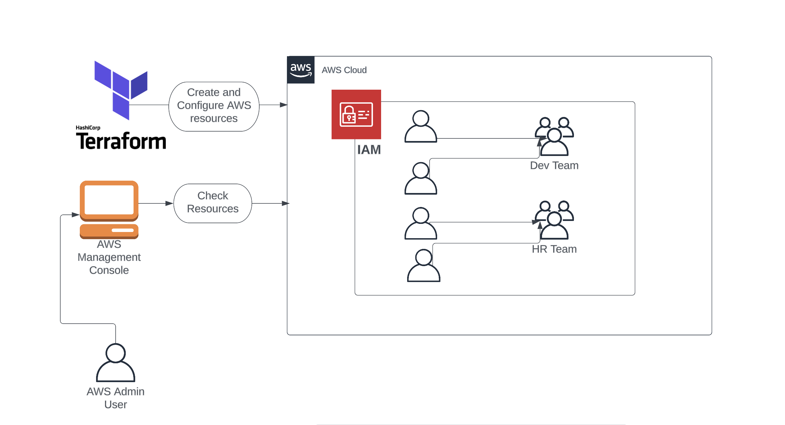
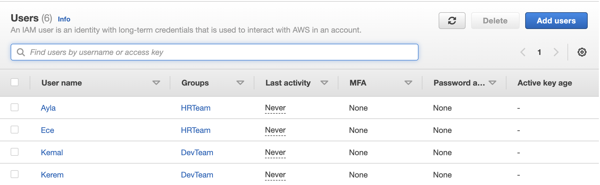
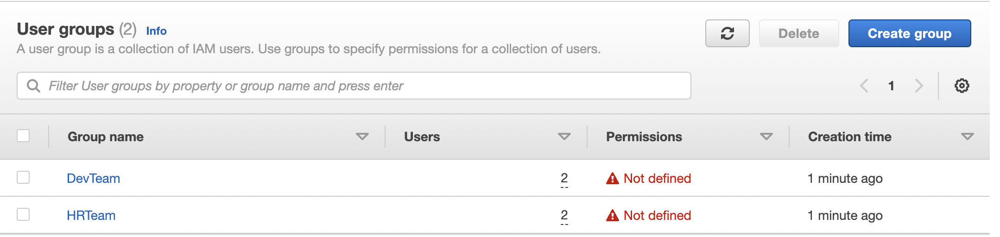
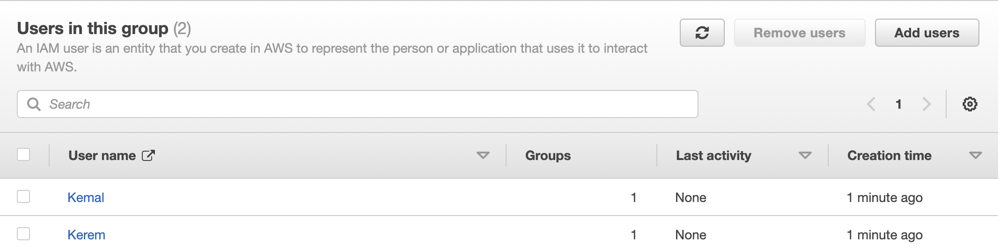
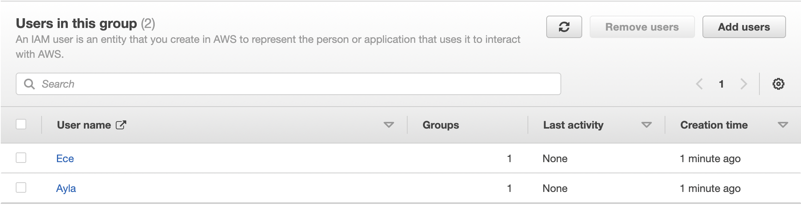

# Creating IAM Users and Groups using Terraform

Task Details

1)Sign into AWS Management Console.

2)Setup Visual Studio Code

3)Create a variable file.

4)Create IAM users in main.tf file

5)Create IAM group and add IAM users in main.tf file 

6)Create an output file

7)Confirm the installation of Terraform by checking the version.

8)Apply terraform configurations

9)Check the resources in AWS Console

10)Delete AWS Resources
